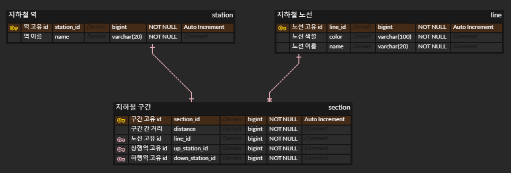

# NEXTSTEP 지하철 노선도 미션
> [ATDD 강의](https://edu.nextstep.camp/c/R89PYi5H) 실습을 위한 지하철 노선도 애플리케이션

## 미션 피드백 링크
- Step 1 : [https://github.com/next-step/atdd-subway-path/pull/481](https://github.com/next-step/atdd-subway-path/pull/481)
- Step 2 : [https://github.com/next-step/atdd-subway-path/pull/514](https://github.com/next-step/atdd-subway-path/pull/514)
- Step 3 : [https://github.com/next-step/atdd-subway-path/pull/525](https://github.com/next-step/atdd-subway-path/pull/525)

## 미션 관련 ERD
- ERD Cloud - https://www.erdcloud.com/d/tquYyrSeEHaqpZThG

## 미션 내용

### STEP 1
- [x]  구간 추가 제약사항 변경
    - [x]  기존에는 마지막 역을 기준으로만 구간 추가 →  위치와 상관 없이 추가 가능
    - [x]  새로운 역을 상행 종점으로 등록할 경우 맨 상위 구간으로 추가
    - [x]  새로운 역을 하행 종점으로 등록할 경우 맨 하위 구간으로 추가
    - [x]  사이에 끼울 경우 각 기존 구간의 상행역 or 하행역을 신규 구간 정보로 잘 변경
    - [x]  노선 조회 시 상행 좀점을 기준으로 역들이 잘 정렬되어 반환
- [x]  구간 추가 예외
    - [x]  상행역과 하행역 둘 중 하나도 포함되어있지 않으면 추가 불가
    - [x]  상행역과 하행역이 이미 노선에 모두 등록되어 있다면 추가 불가
    - [x]  역 사이에 새로운 역을 등록할 경우 기존 역 사이 길이보다 크거나 같으면 추가 불가

### STEP 2

- [x]  구간 삭제 제약 사항 변경
    - [x]  기존에는 마지막 역만 삭제 → 위치에 상관 없이 삭제 가능
    - [x]  종점이 제거될 경우 다음으로 오던 역이 종점이 되도록 구현
    - [x]  중간역이 제거될 경우 재배치
        - A - B - C 구간에서 B 제거 → A - C 로 재배치
        - 거리는 두 구간의 거리의 합 (A-B 거리 + B-C 거리)
- [x]  구간 삭제 예외
    - [x]  노선에 등록되어 있지 않은 역은 제거 불가
    - [x]  구간이 하나인 노선에서 구간 제거 불가

### STEP 3

- [ ] 경로 조회 기능
  - [ ] 출발역 id와 도착역 id로 요청하면 출발역 <-> 도착역까지의 경로에 있는 역 목록이 검색됨 (stations)
  - [ ] 조회한 경로 구간의 총 거리 (distance)
- [ ] 경로 조회 예외
  - [ ] 출발역과 도착역이 같은 경우
  - [ ] 출발역과 도착역이 연결이 되어 있지 않은 경우
  - [ ] 존재하지 않은 출발역이나 도착역을 조회할 경우
