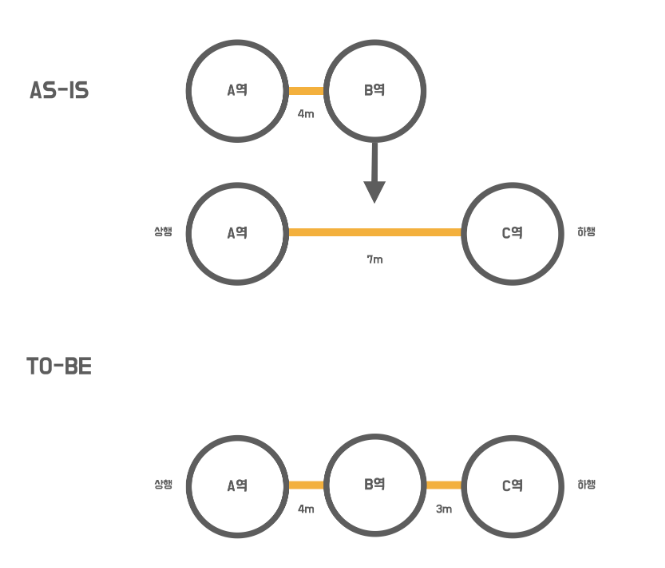
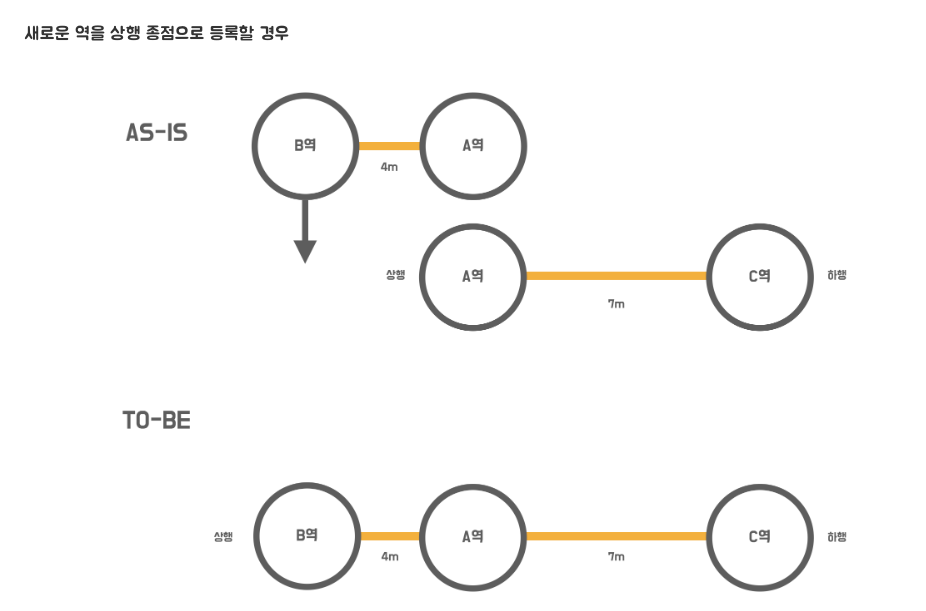
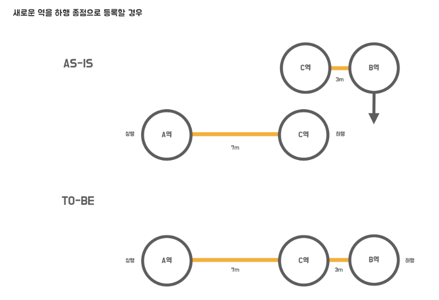
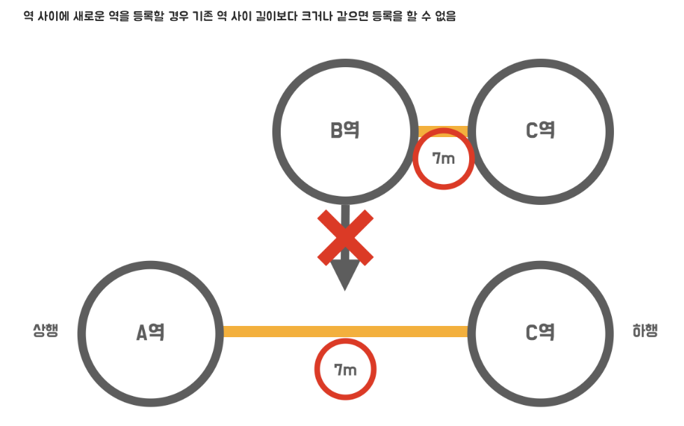
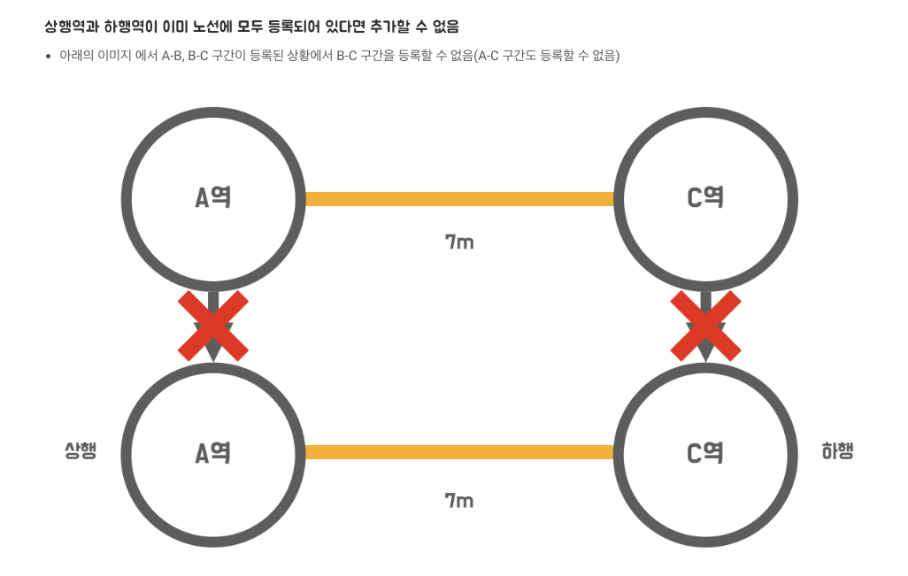
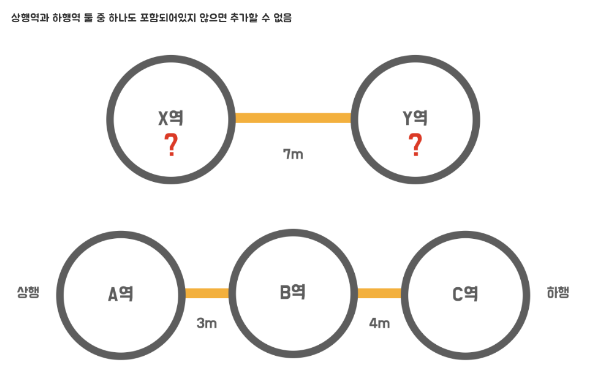

# 🚀 1단계 - 지하철 구간 추가 기능 개선

## 요구사항
### 기능 요구사항

- 기존 구간의 역을 기준으로 새로운 구간을 추가
  - 기존 구간 A-C에 신규 구간 A-B를 추가하는 경우 A역을 기준으로 추가
  - 기존 구간과 신규 구간이 모두 같을 순 없음(아래 예외사항에 기재됨)
  - 결과로 A-B, B-C 구간이 생김
- 새로운 길이를 뺀 나머지를 새롭게 추가된 역과의 길이로 설정

### 노선 조회시 응답되는 역 목록 수정
- 구간이 저장되는 순서로 역 목록을 조회할 경우 순서가 다르게 조회될 수 있음
- 아래의 순서대로 역 목록을 응답하는 로직을 변경해야 함
  - 상행 종점이 상행역인 구간을 먼저 찾는다.
  - 그 다음, 해당 구간의 하행역이 상행역인 다른 구간을 찾는다.
  - 2번을 반복하다가 하행 종점역을 찾으면 조회를 멈춘다.

### 변경된 스펙 - 예외 케이스

