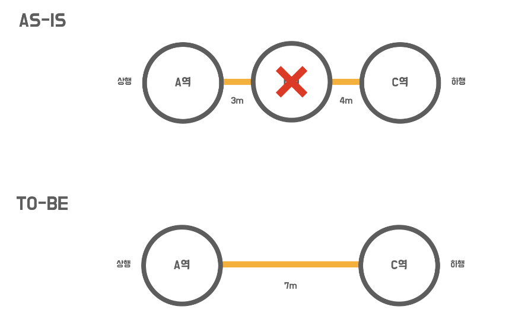
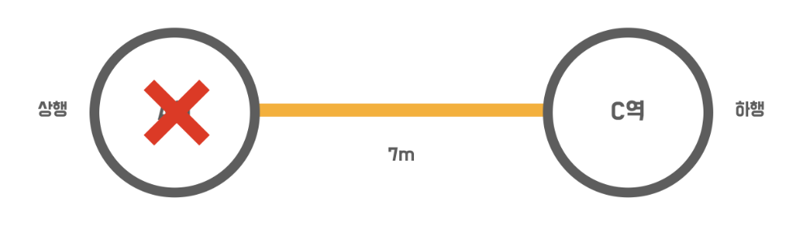

# 요구사항 설명
### 변경된 스펙
- [x] 구간 삭제에 대한 제약 사항 변경 구현
- [x] 기존에는 마지막 역 삭제만 가능했는데 위치에 상관 없이 삭제가 가능하도록 수정
- [x] 종점이 제거될 경우 다음으로 오던 역이 종점이 됨
- [x] 중간역이 제거될 경우 재배치를 함
  - [x] 노선에 A - B - C 역이 연결되어 있을 때 B역을 제거할 경우 A - C 로 재배치 됨
  - [x] 거리는 두 구간의 거리의 합으로 정함

### 구간이 하나인 노선에서 마지막 구간을 제거할 때
- 제거할 수 없음

### 이 외 예외 케이스를 고려하기
- 기능 설명을 참고하여 예외가 발생할 수 있는 경우를 검증할 수 있는 인수 테스트를 만들고 이를 성공 시키세요.
- [x] 노선에 등록되어있지 않은 역을 제거하려 한다.
- [x] 노선에 등록되어있지 않은 역을 제거하려 한다.
