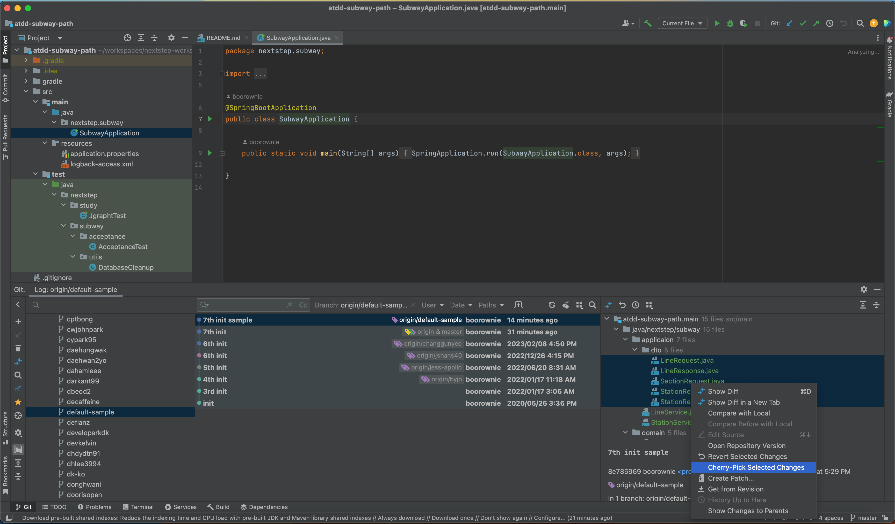

# 🚀 실습 - 단위 테스트 작성

## 미션 준비하기
- 미션 수행 방법 문서를 참고하여 실습 환경을 구축한다.
- 저장소: https://github.com/next-step/atdd-subway-path

## 미션 준비 방법
- 미션을 시작하는 방법은 두 가지 입니다.
- 지난 주차 미션의 코드를 사용하기
- 새로운 뼈대 코드를 사용하기

### 1. 지난 주차 미션의 코드 사용하기
-    지난 주차 미션에서 구현한 코드를 가져옵니다.
-    인텔리제이를 통해 쉽게 코드 가져오기
-    지난 주차 미션에서 구현했던 코드를 옮겨옵니다.
-    만약 아직 미션 수행이 끝나지 않았다면 defalut-sample 브랜치를 참고하여 코드를 옮겨 옵니다.

### 2. 새로운 뼈대 코드를 사용하기
-    아직 미션이 끝나지 않았거나 재사용하기 어려운 경우 샘플 코드로 시작할 수 있습니다.
-    default-sample 브랜치에서 샘플 뼈대 코드를 확인할 수 있습니다.
-   샘플 뼈대 코드를 수정 없이 그대로 사용하지 마세요!
   
## 힌트
   - 인텔리제이 하단에 Git 탭을 선택합니다.
   - 좌측 영역에서 default-sample 브랜치를 찾아서 더블클릭 하면 가운데 커밋 목록이 보입니다.
   - 커밋목록에서 sample 코드가 있는 커밋을 선택하면 우측 영역에 상세 내역이 보입니다.
   - 우측 영역에서 반영하고 싶은 코드를 선택하여 Cherry-Pick Selceted Changes 를 누르면 현재 브랜치에 반영됩니다.

   
   

## 테스트 실습
### 기능 요구사항
- 지하철 구간 관련 단위 테스트를 완성하세요.
    - 구간 단위 테스트 (LineTest)
    - 구간 서비스 단위 테스트 with Mock (LineServiceMockTest)
    - 구간 서비스 단위 테스트 without Mock (LineServiceTest)
    - 단위 테스트를 기반으로 비즈니스 로직을 리팩터링 하세요.