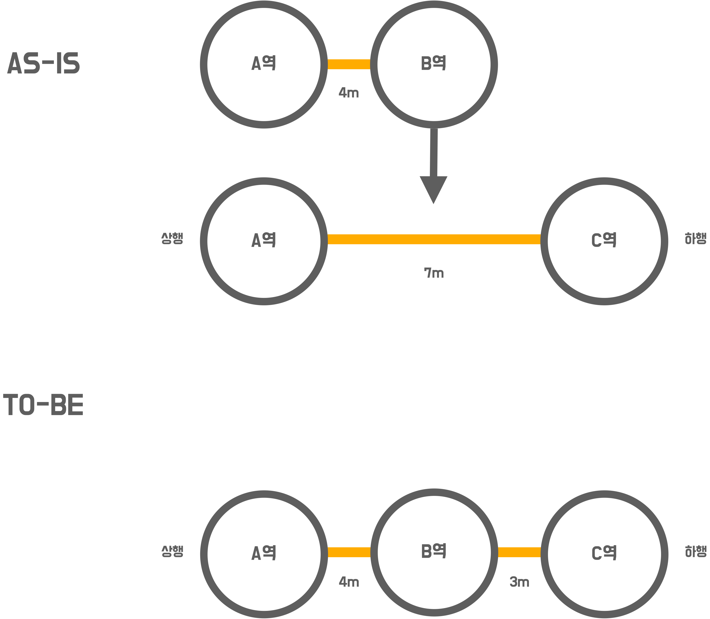

# 🚀 1단계 - 구간 추가 요구사항 반영

## 요구사항
- 사용자 스토리를 기반으로 기능 요구사항(완료 조건)이 도출되었습니다.
- 완료 조건을 검증할 수 있는 인수 조건을 시나리오 형태로 도출하세요.
- 인수 조건을 검증하는 인수 테스트를 작성하세요.

> 모든 경우의 수를 검증하는 인수 조건을 만들 필요는 없습니다. 미션의 목표는 기능을 완벽하게 구현하는 것이 아니라 TDD 사이클을 경험하는 것 입니다.

## 사용자 스토리
```
사용자로서
지하철 노선도를 조금 더 편리하게 관리하기위해
위치에 상관없이 지하철 노선에 역을 추가 할 수 있다
```
## 기능 요구사항(완료 조건)
- 노선에 역 추가시 노선 가운데 추가 할 수 있다.
- 노선에 역 추가시 노선 처음에 추가 할 수 있다.
- 이미 등록되어있는 역은 노선에 등록될 수 없다.
## 프로그래밍 요구사항
- 인수 테스트 주도 개발 프로세스에 맞춰서 기능을 구현하세요.
  - 요구사항 설명을 참고하여 인수 조건을 정의
  - 인수 조건을 검증하는 인수 테스트 작성
  - 인수 테스트를 충족하는 기능 구현
- 인수 조건은 인수 테스트 메서드 상단에 주석으로 작성하세요.
  - 뼈대 코드의 인수 테스트를 참고
  
## 힌트
> 힌트 외에도 필요한 상황에 대한 요구사항 고려해서 구현해주세요.

### 노선에 역 추가시 노선 가운데 추가 할 수 있다.
- 기존 구간의 역을 기준으로 새로운 구간을 추가
  - 기존 구간 A-C에 신규 구간 A-B를 추가하는 경우 A역을 기준으로 추가
  - 기존 구간과 신규 구간이 모두 같을 순 없음(아래 예외사항에 기재됨)
  - 결과로 A-B, B-C 구간이 생김
- 새로운 길이를 뺀 나머지를 새롭게 추가된 역과의 길이로 설정

