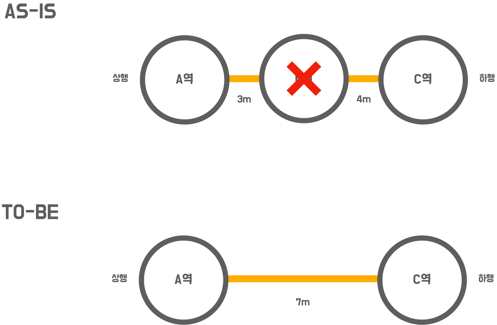

# 🚀 2단계 - 구간 제거 요구사항 반영

## 요구사항
- 사용자 스토리를 기반으로 기능 요구사항(완료 조건)이 도출되었습니다.
- 완료 조건을 검증할 수 있는 인수 조건을 시나리오 형태로 도출하세요.
- 인수 조건을 검증하는 인수 테스트를 작성하세요.

> 모든 경우의 수를 검증하는 인수 조건을 만들 필요는 없습니다. 미션의 목표는 기능을 완벽하게 구현하는 것이 아니라 TDD 사이클을 경험하는 것 입니다.

## 사용자 스토리
- 사용자로서
- 지하철 노선도를 조금 더 편리하게 관리하기위해
- 위치에 상관없이 지하철 노선에 역을 제거 할 수 있다

## 기능 요구사항(완료 조건)
- 노선에 등록된 역 제거 시 해당 역이 노선 가운데 있어도 제거할 수 있다.
- 노선에 등록된 역 제거 시 해당 역이 상행 종점역이어도 제거할 수 있다.

## 프로그래밍 요구사항
- 인수 테스트 주도 개발 프로세스에 맞춰서 기능을 구현하세요.
  - 요구사항 설명을 참고하여 인수 조건을 정의
  - 인수 조건을 검증하는 인수 테스트 작성
  - 인수 테스트를 충족하는 기능 구현
- 인수 조건은 인수 테스트 메서드 상단에 주석으로 작성하세요.
  - 뼈대 코드의 인수 테스트를 참고

## 힌트
> 힌트 외에도 필요한 상황에 대한 요구사항 고려해서 구현해주세요.

### 노선에 등록된 역 제거 시 해당 역이 노선 가운데 있어도 제거할 수 있다.
- 기존에는 마지막 역 삭제만 가능했는데 위치에 상관 없이 삭제가 가능하도록 수정
- 종점이 제거될 경우 다음으로 오던 역이 종점이 됨
- 중간역이 제거될 경우 재배치를 함
  - 노선에 A - B - C 역이 연결되어 있을 때 B역을 제거할 경우 A - C로 재배치 됨
  - 거리는 두 구간의 거리의 합으로 정함

